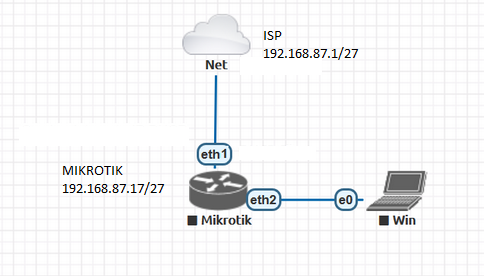

# LAB-5-Mengkoneksikan-Mikrotik-ke-Internet
Selasa 12 Agustus 2025
  
# Konfigurasi Mikrotik ke Internet dengan IP dynamic  
  
  1. Pasang kabel sesuai topologi diatas. **Interfaces > Interface list**  
  2. Ganti nama Interface agar lebih mudah  
     Ether-1-WAN (untuk mendapat internet dari ISP)  
     Ether-2-LAN (untuk koneksi ke client)  
  
  4. Konfig DHCP Client untuk ether1, **IP > DHCP-Client > add(+) > Enabled [V] > interface=ether1-WAN > use peer dns=yes > use peer ntp=yes > add default route=yes**  
     Jika sudah, pastikan statusnya **bound**  
  
  5. Cek koneksi mengunakan **ping** di terminal  
  6. Jika berhasil, hasilnya akan reply.  
  

#  Konfigurasi Mikrotik ke internet dengan IP static   

  1. Buat IP Address untuk ether1, **IP > Addresses > +**, pastikan IP nya satu network dengan IP Gateway dari ISP.  
       
  2. Selanjutnya masukan gateway, **IP > route > +**  
       
  3. Setting DNS  
       
  5. Jalankan terminal dan coba ping ke 8.8.8.8 untuk pengujiannya  
  6. Jika berhasil, maka hasilnya akan reply  
       

# Kesimpulan
  Dynamic IP cocok untuk awam karna client mendapat IP secara otomatis. Sedangkan Static IP kurang cocok untuk pengguna awam, karna diperlukan pengetahuan dasar Mikrotik/Jaringan .
